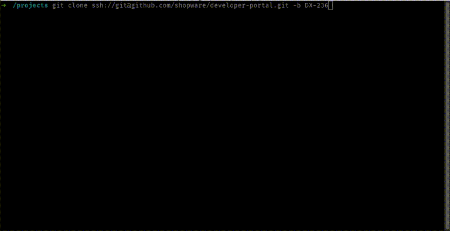
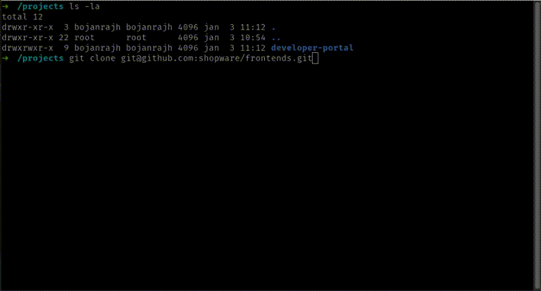
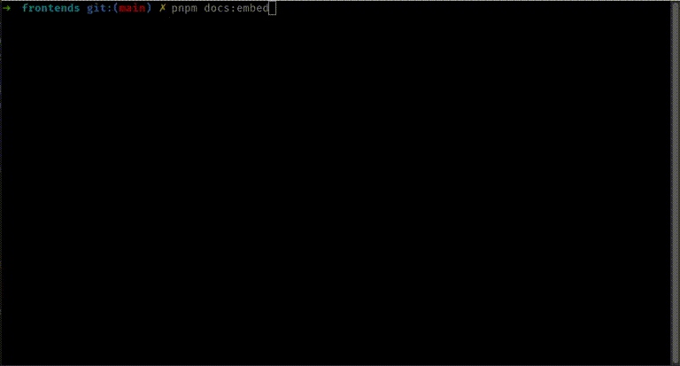
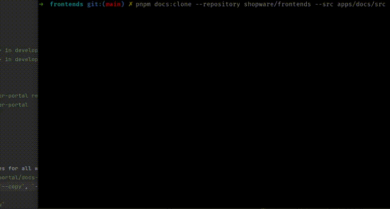
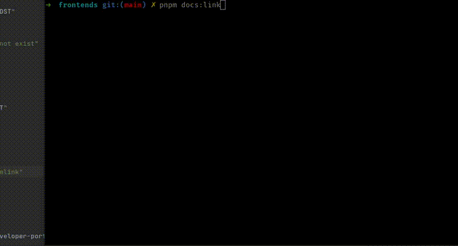
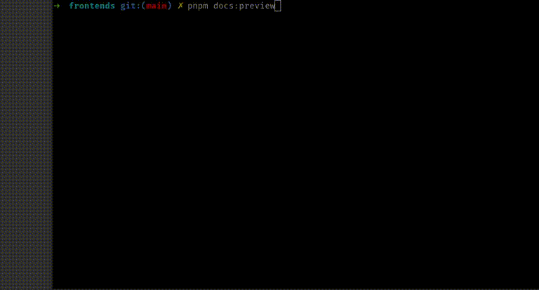
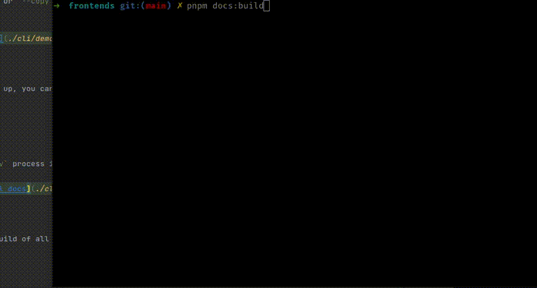
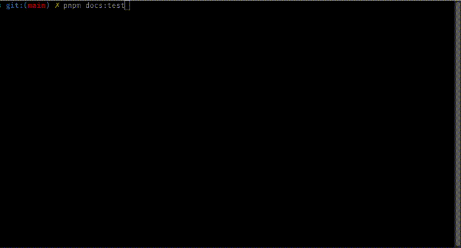

# Shopware Docs CLI

Shopware Docs CLI is a tool for managing commands and mountpoints for `developer-portal`.

```
Usage: docs-cli [options] [command]

Shopware Docs CLI

Options:
  -V, --version     output the version number
  --vv              --verbose
  --vvv             --debug
  -h, --help        display help for command

Commands:
  install           Update aliases/scripts in package.json
  embed [options]   Embed all docs repositories to developer-portal
  clone [options]   Clone <src> from <branch> in <repository> to <dst> in developer-portal
  link [options]    Copy <src> from current working directory to <dst> in developer-portal
  cleanup           Remove <dst> in developer-portal
  manage            Add or remove mountpoints in developer-portal
  preview           Preview docs
  build             Build docs in developer-portal
  test [options]    Run vitest end-to-end suite in your local developer-portal repository. Use build flag (-b / --build) to run test on the build instead of dev server.
  pull              Pull docs and install new dependencies in developer-portal
  git [options]     Checkout all repos to the ./repos/
  config [options]  Reconfigure .docs-cli
  help [command]    display help for command
```

## TL;DR

- Clone `shopware/developer-portal` repository and install dependencies for all workspaces (`pnpm i`)
- _(one-time)_ Set up aliases in your `package.json` - `../developer-portal/docs-cli install`
- _(one-time)_ Link local documentation - `pnpm docs:link` (optional `--copy`, `--rsync` or `--symlink` (default)
  flags)
- Write your docs and preview local documentation - `pnpm docs:preview`

You might also want or need to:

- Embed some or all docs from remote repositories directly from your project - `pnpm docs:embed`
- Pull changes in `developer-portal` directly from your project - `pnpm docs:pull`

Read following sections for more in-depth description about the workflow.

# Setup

## Clone and install `developer-portal`

Clone `developer-portal` repository to your computer and install dependencies.

```bash
$ cd /www
$ git clone ssh://git@github.com/shopware/developer-portal.git
$ cd developer-portal
$ pnpm i
```

Build the CLI.

```bash
$ pnpm cli:build
```

Run it.

```bash
# from a symlink
$ ./docs-cli
# from the source
$ ./cli/dist/docs-cli.js

```



### Using pkg

Optionally, you can pack your build afterwards with pkg using `cli:pkg` command.

```bash
$ pnpm cli:pkg
```

This command will replace all `require` and `import` statements, embed package dependencies in single file, and prepare
a built specific to your OS.

```bash
$ ./cli/dist/docs-cli-linux
$ ./cli/dist/docs-cli-mac
$ ./cli/dist/docs-cli-win.bat

```

## Local storage

The tool will ask you to configure your _root_ projects directory and `developer-portal` repository on-the-fly when it
needs to reference the correct dir.

CLI will create a `.docs-cli` directory in your root/projects dir and save some configuration (directory configuration,
env vars for Figma, GitLab credentials, ...):

- `/www/.docs-cli` if you have your projects located in `/www/$project`
- `/home/user/projects/.docs-cli` if you have your projects located in `/home/user/projects/$project`
- `/projects-bar/.docs-cli` if you have your projects located in `/projects-bar/$project`

## Install aliases to your `package.json`

Continue by adding common aliases to your projects' `package.json`. You can do this automatically by
running `../developer-portal/docs-cli install` from your project dir and select aliases that you would like to use.

```sh
$ ../developer-portal/docs-cli install
```

This will alter your `package.json` scripts with selected aliases:

```json
{
  "scripts": {
    "docs:link": "../developer-portal/docs-cli link",
    "docs:preview": "../developer-portal/docs-cli preview",
    "docs:embed": "../developer-portal/docs-cli embed"
  }
}
```



# Config

CLI will use first available config for every property:

- default configuration - see [./cli/src/data.ts](./cli/src/data.ts)
- command flags/params - `--repository`, `--branch`, `--org`, `--user`,  `--pass`
- env variables
- `.docs-cli` config

By default, all commands mounts/embeds repositories from the `main` branch on public `shopware` organization on GitHub.

You can use `--configure` (or `-c`) and manually enter custom branches and organizations for testing feature branches
and forked repositories.

```sh
$ pnpm docs:embed --configure
```

Configured data will be saved in your parent `.docs-cli` directory unencrypted. You can manually delete those files or
reconfigure them by running `config` command.

```bash
# reconfigure
$ pnpm docs:config
# view all configs
$ pnpm docs:config --view
# destroy configuration
$ pnpm docs:config --destroy

```

## Env variables

See default repository and branch configuration in [./cli/src/data.ts](./cli/src/data.ts).

You can set and `export` env variables for CI (secret).

### Branches

Branch configs default to `main` branch.

- `BRANCH_DOCS`
- `BRANCH_FRONTENDS`
- `BRANCH_ADMIN_EXTENSION_SDK`
- `BRANCH_METEOR_ICON_KIT`
- `BRANCH_METEOR_COMPONENT_LIBRARY`

### Organisations

Organization configs default to `shopware`.

- `ORG_DOCS`
- `ORG_FRONTENDS`
- `ORG_ADMIN_EXTENSION_SDK`
- `ORG_METEOR_ICON_KIT`
- `ORG_METEOR_COMPONENT_LIBRARY`

### Username and password (private, GitLab only)

- `GITLAB_FRONTENDS_USERNAME`
- `GITLAB_FRONTENDS_ACCESS_KEY`

# Available commands

- [Embed all docs](#embed-all-docs)
- [Clone single repository](#clone-single-repository)
- [Link your docs](#link-your-docs)
- [Manage all docs](#manage-your-docs)
- [Preview your docs](#preview-your-docs)
- [Build all docs](#build-all-docs)
- [Test all docs](#test-all-docs)
- [Remove mount points](#remove-mount-points)
- [Update developer-portal repository](#update-developer-portal-repository)

## Embed all docs

This is only needed for the `build` and `test` processes to work because they require all docs to be properly mounted.

```sh
$ pnpm docs:embed
```

This command will ask you to enter your configuration and clone all remote repositories into your
local `developer-portal` checkout.



## Clone single repository

The `embed` command uses `clone` command under the hood. You can manually clone remote repositories by running the
`docs:clone` command.

```bash
$ pnpm docs:clone \
  --repository shopware/frontends \
  --branch feature-branch \
  --org your-user
  --src apps/docs/src \
  --dst frontends-test

```

This command will one-time clone the `feature-branch` from your `your-user/frontends` repository and
mount `app/docs/src` into `docs/frontend-test` directory in `developer-portal`, making it accessible on
the [https://localhost:2345/frontends-test](https://localhost:2345/frontends-test) URL.



## Link your docs

This command links your local repository into your local `developer-portal` checkout.

```sh
$ pnpm docs:link
```

You need to use `--rsync` or `--copy` if you want to `test` or `build` docs locally due to symlinking issues with
Rollup.



## Manage your docs

This command removes selected mountpoints and re-mounts them in `developer-portal` checkout.

```sh
$ pnpm docs:manage
```

## Preview your docs

Once your aliases are set up, you can run `preview` command to preview docs.

```sh
$ pnpm docs:preview
```

This command will run `dev` process in your local `developer-portal` checkout.



## Build all docs

You can create a static build of all docs by running the `build` command.

```sh
$ pnpm docs:build
```

This command will run `build` process in your local `developer-portal` checkout and requires all docs to be cloned from
remote or linked with `--rsync` or `--copy` strategy.



Preview production build with `httpd:2.4` in Docker container - [http://localhost:8765](http://localhost:8765).

```sh
$ pnpm docs:preview:http
```

## Test all docs

You can run tests in `developer-portal` repository by running `test` or `test:build` commands.

```sh
$ pnpm docs:test
# or
$ pnpm docs:test:build
```

Standard `test` command will run Vitest tests with the bundled dev server and works with partially mounted docs.

THe `test:build` command will create a production build on-the-fly and requires all docs to be hard-mounted (no
symlinks).



## Remove mount points

You can remove mounted repositories by running the `cleanup` command.

```sh
$ pnpm docs:cleanup
```

This command will remove symlinks and other mounted folders from your local `developer-portal` checkout.

The same output can be achieved with deleting mounted repositories by hand.

```sh
$ cd ../developer-portal
$ git status
$ rm -r docs/frontends/
$ rm -r docs/resources/admin-extension-sdk
# ...
```

## Update `developer-portal` repository

Keep your local `developer-portal` checkout up to date by running the `pull` command.

```sh
$ pnpm docs:pull
# or
$ cd ../developer-portal && git pull --ff && pnpm i

```

This command will pull changes in `developer-portal` on your current branch and install the latest dependencies.


## Checkout and symlink all repositories inside the project

If you don't want to check out all project separately, you can check out them directly into the `repos` folder in your
`developer-portal` repository and create symlinks in the `src/<mount-point>` folder by running the `git` command.

```sh
$ ./docs-cli git
```

Instead of having a flat structure like this ...
```text
/www/developer-portal/
/www/docs/
/www/frontends/
/www/.../
```

... you will end up with a deep structure like this:
```text
/www/developer-portal/
/www/developer-portal/repos/docs-next/
/www/developer-portal/repos/docs-6.4/
/www/developer-portal/repos/docs-6.3/
/www/developer-portal/repos/frontends-main/
/www/developer-portal/repos/.../
```

## More

```bash
# aliased
pnpm docs:<COMMAND>
# equals
../developer-portal/docs-cli <COMMAND>

```