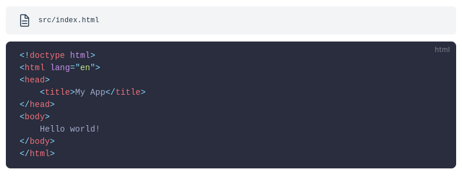
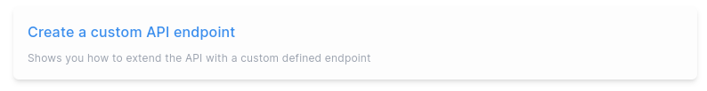
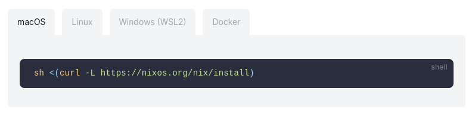
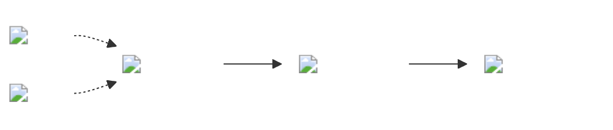
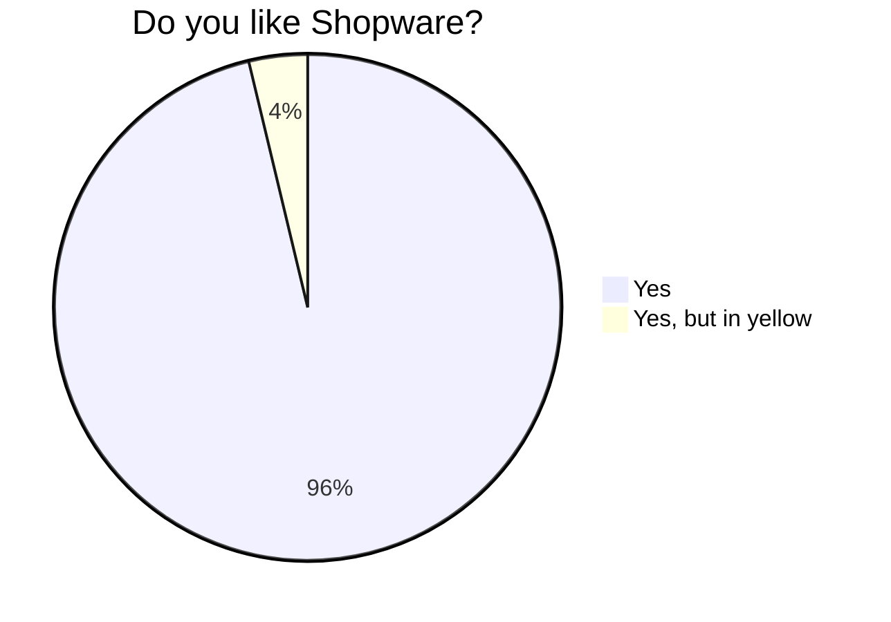

# Features

## VueJS Components

Custom VueJS SFC are supported by default.

<!--

### ActionItem

`<ActionItem>`

### LandingWrapper

`<LandingWrapper>`

### TopBar

`<TopBar>`

### RegistrationForm

`<RegistrationForm>`

-->

### `<CodeBlock>`



### `<PageRef>`



### `<Tabs>` and `<Tab>`



## Sidebar auto-generation

Sidebar can be automatically generated using the `buildSidebarNav` helper which traverses through all links (folders),
builds a structure with metadata available on every page, and navigation config with `repo` property to change the 
source of .md files (for the "Edit on GitHub" link to work properly).

See `.vitepress/navigation.ts` to see how the sidebar is configured and auto-generated.

## Sidebar configuration

Sidebar can be configured by custom YML in your .md file (frontmatter). This allows us to change the `title` displayed
in the sidebar, change the `position` of item in the sidebar, add custom `class` and display the link differently, use
`nolink` to display the text only, and use `hidden` to hide the item from the sidebar because all articles are
automatically added to the sidebar.

```yaml
nav:
  title: Custom title
  position: 123
  class: custom-class
  nolink: true
  hidden: true
```

## Search

Algolia search is integrated with their DocSearch feature.

## Mermaid





## APIs

Internal APIs (Store & Admin) are automatically generated with Stoplight.

## Sitemap

Generate sitemap for SERP.

# External config

## Extending

After the CLI clones your git repo, and before it builds docs, you can enrich output by
creating `.github/scripts/docs-after-clone.sh` in your repository. This is only supported in `embed` and `clone`
commands. If you'll use `link` command, you need to run your script manually, as needed.

## Copying static assets

## Standalone usage

Similar to how we've built `developer-portal`, you can base another separate project by using
`developer-documentation-vitepress` package. See [SETUP](./SETUP.md) for more info on the process.

# Beta

## Visual (regression) testing

Visually compare changes to prevent some issues.

## Change report generation

Generate change report for developer marketing team.