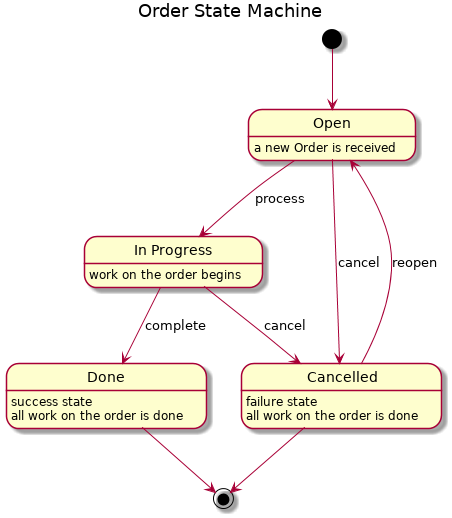
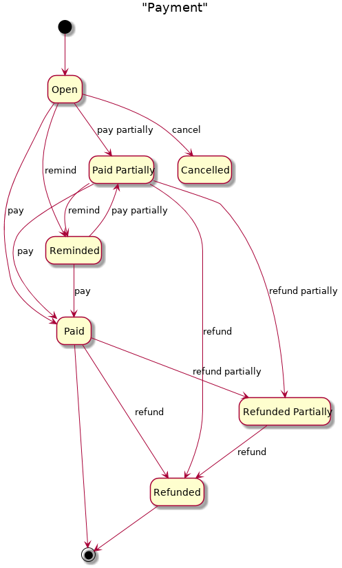
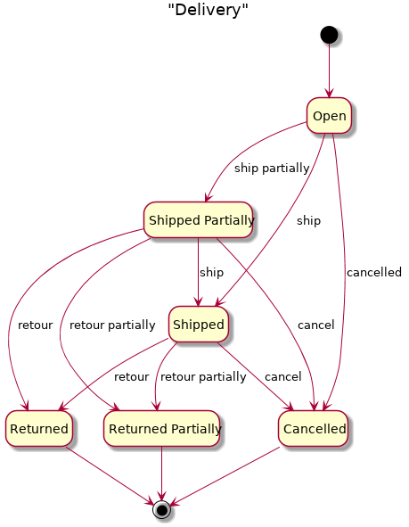

# Orders

From a Cart instance an `Order` can be created. The whole structure of the cart is stored to the database. Contrary to the cart, a structure that allows a great degree of freedom and is _calculation optimized_ , the order is **workflow optimized**.

## Design goals

### Denormalization

The Order itself does not depend on the catalog or the products. The line item with all of its data, as well as all calculated prices, are persisted in the database. Orders only get recalculated when specifically triggered through the API.

### Workflow dependant

The order state changes in a defined, predictable and configurable way - other state transitions are blocked.

## State management

During the order placement, at least three distinct state machines are started.

* One concerning the order as a whole _\(diagram The order state machine\)_
* One concerning each transaction _\(diagram The transactions state machine\)_
* One concerning each delivery _\(diagram The delivery state machine\)_

These can be used to track the progress during the order process and notify the customer about the current state of the order.

_Note: The state machines displayed in the following sections can actually be modified through the API, this is just the default setup._

