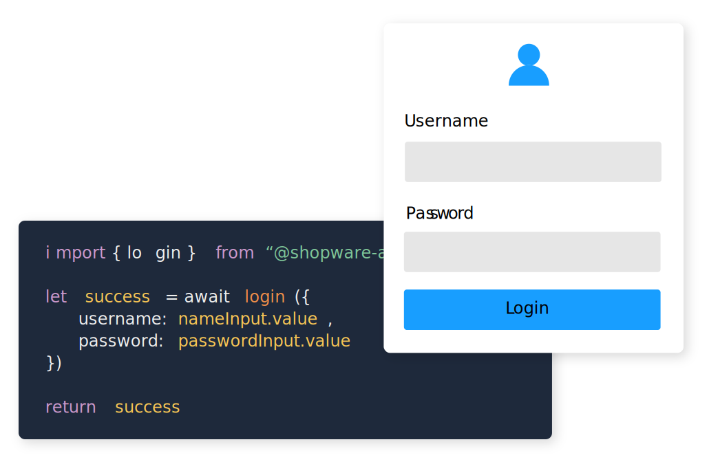

# Build outstanding shopping experiences

<div class="grid grid-cols-1 md:grid-cols-2 gap-20">

<div>

Shopware offers a flexible customer-facing API that will allow you to build highly custom shopping experiences. Either start from scratch with our API reference or get some help using one of our SDKs.

If you want to start with something more off-the-shelf, but still have all the flexibility you need at hand - check out [Shopware Frontends]()

```bash
yarn showpare-pwa init
```

</div>

<div class="order-first md:order-none">



</div>

</div>
